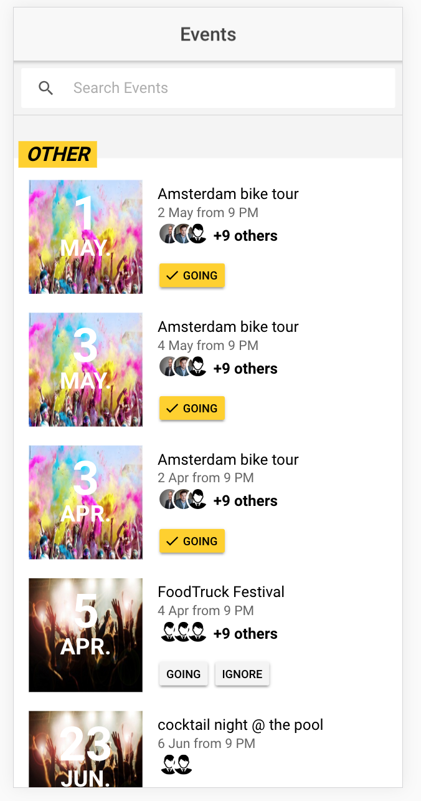
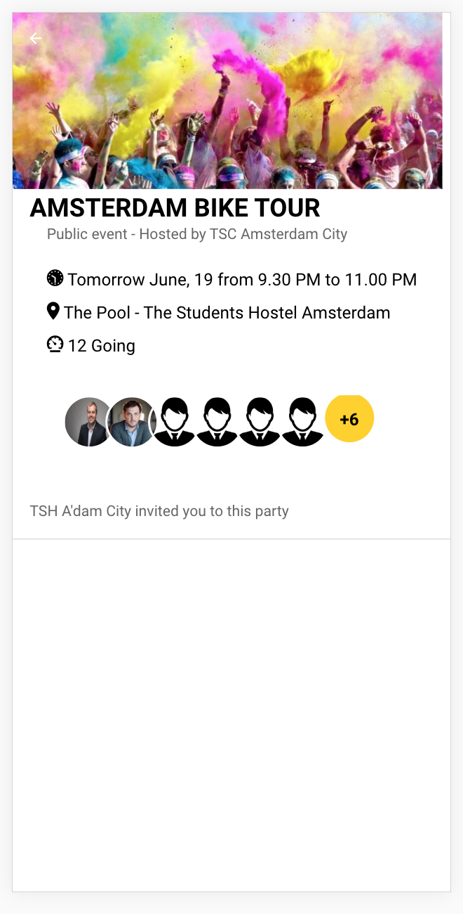

# Sample Ionic App

### Instalation
```
git clone https://github.com/mgruszkas/events.git
cd events
npm install
```

### Running test cases
```
npm run test
```
### Design
<div align="center"> 


</div>